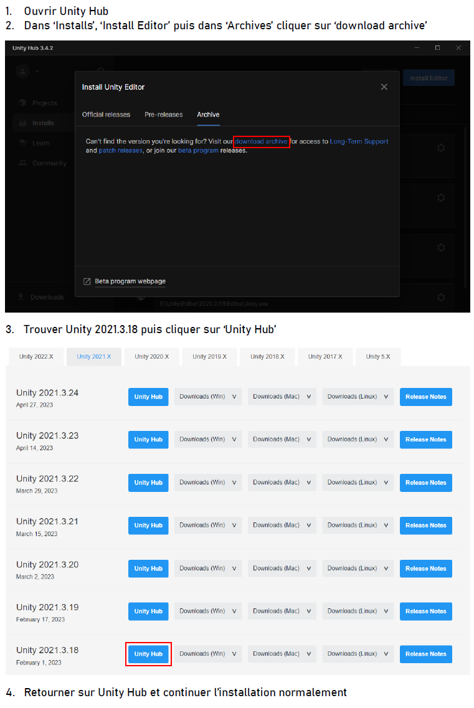

# Projet M1 - Exploration subaquatique en réalitée virtuelle

## Membres du groupe :
* Arthur *HERBLOT*
* Julie *RICOU*
* Florian *AUBERVAL*
* Solal *COQUERON*

### Pour ouvrir le projet, il faut la version `2021.3.18f1` de [Unity](https://unity.com/fr). (instructions d'installation à la fin)

#### Autres liens relatifs au projet :
* [Google drive](https://drive.google.com/drive/folders/1RxbuIoPCKq4foo5SS9x1tLB-uXjwEos-?usp=sharing) : pour voir nos démonstrations et avoir les executables du projet

### Mises à jour :
* **Version 3.0 (6 mai 2023):**
    * Mise à jour de la version de Unity vers la version 2021.3.18f1​
    * Changement de pipeline graphique vers le pipeline URP​
    * Amélioration de la faune et de la flore​
	* Ajout de faunes différentes (espèces de poissons, prédateurs, faune au sol)​
	* Ajout de biomes pour la flore​
	* Diversification de la flore​
	* Optimisation de la faune et de la flore​
	* Amélioration de l'animation de la faune​
	* Ajout d'une animation pour la flore​
    * Amélioration de la texture du terrain​
* **Version 2.0 (16 mai 2022):**
    * Diversification de la flore​
	* Ajout de la faune​
	* Ajustement des commandes VR​
	* Caustiques​
	* Système de scan​
	* Refonte de l'interface​
* **Version 1.1 (6 mai 2021):**
    * Correction d'un bug mineur
* **Version 1.0 (5 mai 2021):**
    * Système de génération de terrain complet
    * Flore complète
    * Rendu de l'eau et god rays
    * Rendu volumétrique sous l'eau
    * Controlleur clavier-souris et VR
    * Sons & musiques
    * Texture du terrain
* **Version 0.2 (14 février 2021):**
    * Refonte du sytème de génération de mesh
    * Système de chunk
    * Interface avec des données de debug
* **Version 0.1 (1 février 2021):**
    * Implémentation de SimplexNoise en HLSL
    * Génération de bruit sur GPU
    * Visualisation du bruit
    * Implémentation de Marching Cubes sur GPU
    * Génération asynchrone du mesh

### Notes d'utilisation :
Lors du premier chargement, il est possible que la scène principale ne soit pas charger, pour la charger, dans l'explorateur d'Unity double cliquez sur `Scenes/MainScene`.

Par defaut dans la hiérarchie d'Unity, l'objet nommé **MKPlayer** est actif. Le **MKPlayer** permet de joueur au clavier-souris avec les meilleurs performances. Pour jouer en VR, désactiver le **MKPlayer** et activer l'objet nommé **VR**.

##### Voici les paramètres ayant un impact sur les FPS :
* Dans le script `Scripts/Static/Vars.cs` il y a deux valeurs : `FLORA_DENSITY` qui régis le nombre d'éléments de flore par biome et par chunk et `REF_CHUNK_TRI_COUNT` qui définit la "moyenne" de triangles par chunk, il faut l'adapter si des changements sont fait à la résolution du chunk. (Gain de FPS variable, à ajuster en cas de soucis)
* Dans l'objet **Post-process Volume** désactiver l'**Ambiant Occlusion** (gain allant de 10 à 20 FPS).
* Dans `Resources/Core/BaseChunkParameters` ajuster la densité du chunk. Le gain de FPS peut être important à un coût graphique important.

### Instructions pour installer la bonne version d'Unity

